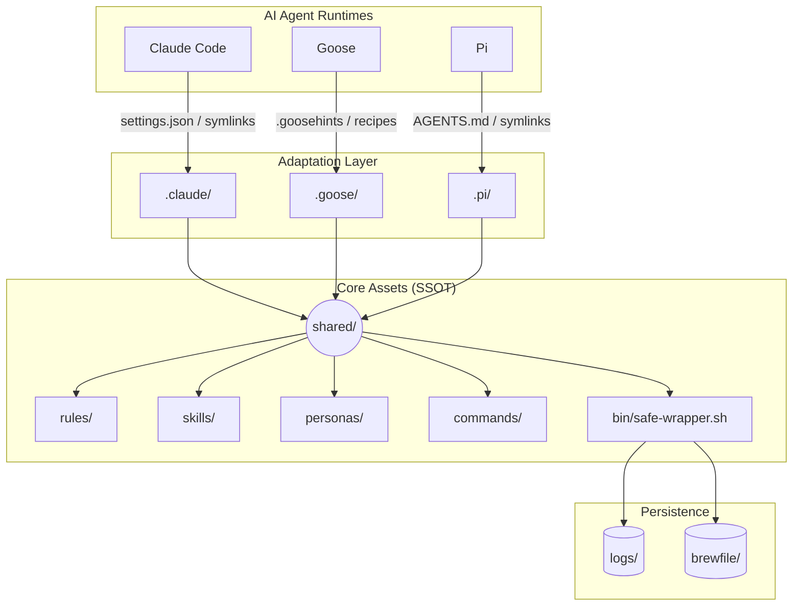

# 🌌 Universal macOS Ops Architecture (sysops-universal)

[](https://opensource.org/licenses/MIT)
[](https://www.apple.com/macos/)
[](https://github.com/williamwang-ty/workspace-sysadmin)

> **Transform your AI Agents into professional macOS SREs.** 
> A centralized, platform-agnostic operational framework designed to maximize logic reuse across different AI runtimes while enforcing strict safety guardrails.

---

## 🏗️ Architecture Overview

The system follows a **Single Source of Truth (SSOT)** design. All operational logic, safety rules, and skills reside in the `shared/` directory, bridged to specific AI agents via symlinks or native configurations.



---

## ✨ Key Features

### 🧩 1. Multi-Agent Orchestration
Native support for the top AI coding and ops agents. Write your SOP (Standard Operating Procedure) once, and use it everywhere.
- **Claude Code**: Full integration with `PreToolUse` hooks and native subagent isolation.
- **Goose**: Lightweight bridging via `.goosehints` and YAML recipes.
- **Pi**: Context-engineered prompts with local skill discovery.

### 🛡️ 2. Dual-Layer Safety System
- **Soft Defense**: Global `safety-rules.md` injected into system prompts to define cognitive boundaries.
- **Hard Defense**: `safe-wrapper.sh` acts as a physical interceptor, performing regex-based command blocking and mandatory audit logging.

### 🛠️ 3. Modular Skills & Personas
- **Specialized Personas**: Switch between `troubleshooter`, `installer`, and `cleanup-auditor` roles without context drift.
- **Rich Skills**: Plug-and-play modules for Homebrew management, system diagnostics, and issue remediation.

### 📈 4. Infrastructure as Code (IaC)
Every `brew install` or `uninstall` is automatically tracked and exported to a centralized `Brewfile`, ensuring your environment stays reproducible and version-controlled.

---

## 📁 Directory Structure

| Path | Purpose |
| :--- | :--- |
| `shared/bin/` | **The Brain**: Security wrappers and diagnostic scripts. |
| `shared/rules/` | **The Law**: Core instructions and safety redlines. |
| `shared/skills/` | **The Capabilities**: Standardized SOPs with YAML frontmatter. |
| `shared/personas/` | **The Experts**: Specialized AI role definitions. |
| `shared/commands/` | **The Shortcuts**: Predefined interactive commands. |
| `logs/` | **The Memory**: Daily audit logs of all executed operations. |

---

## 🚀 Quick Start

### 1. Installation
Clone the repository and run the self-diagnostic script:
```bash
git clone https://github.com/williamwang-ty/workspace-sysadmin.git
cd workspace-sysadmin
bash shared/bin/doctor-check.sh
```

### 2. Connect Your Agent
- **Claude Code**: Automatically recognizes `CLAUDE.md`. Symlinks are pre-configured in `.claude/`.
- **Goose**: Uses `.goosehints` for routing.
- **Pi**: Uses `AGENTS.md` for system instructions.

---

## 📜 Principles of Operation

1. **Anti-Drift**: No business logic is allowed inside agent-specific folders. Everything must be in `shared/`.
2. **Safe by Default**: Direct shell access is forbidden; all commands must pass through the `safe-wrapper`.
3. **Knowledge First**: If a fix works twice, it belongs in a `shared/sops/` file.

---

## 🤝 Contributing

Contributions are welcome! Please ensure all new skills follow the standard `SKILL.md` template with proper metadata in `shared/skills/`.

---

## 📄 License

Distributed under the MIT License. See `LICENSE` (if applicable) for more information.

---
*Created with ❤️ by the Universal Ops Team.*
